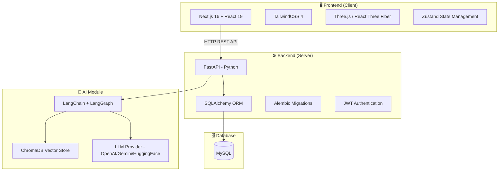
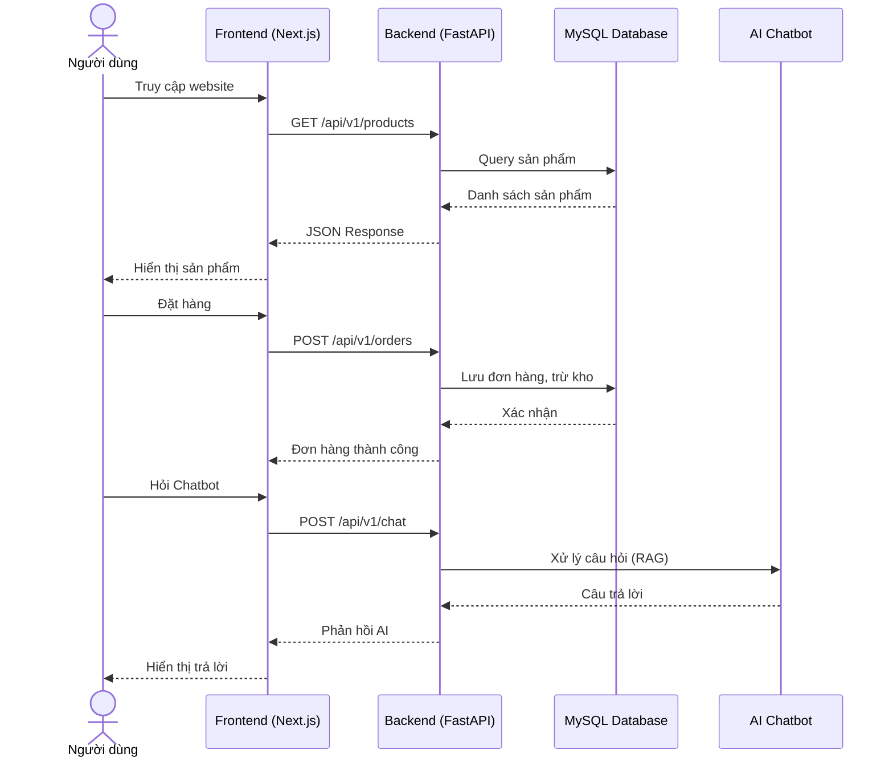
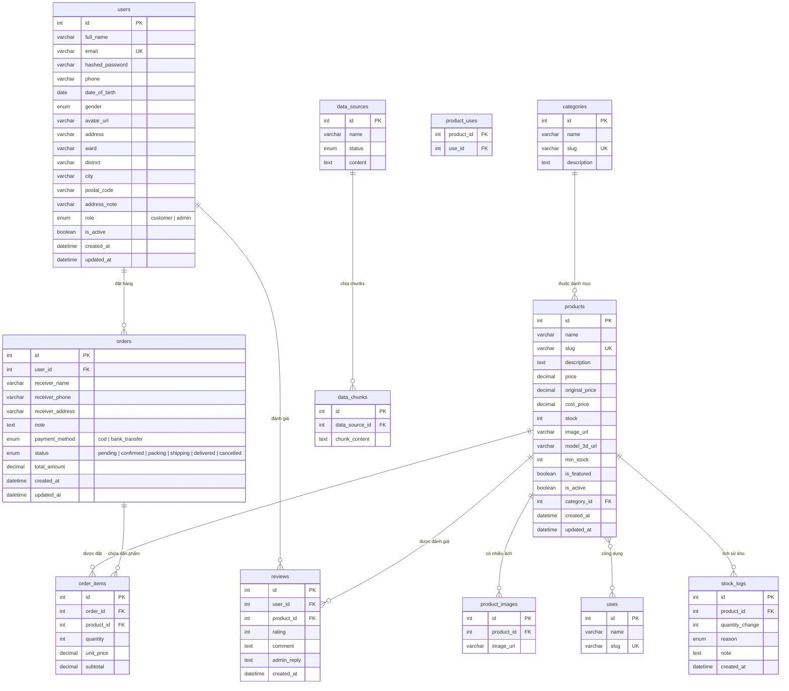
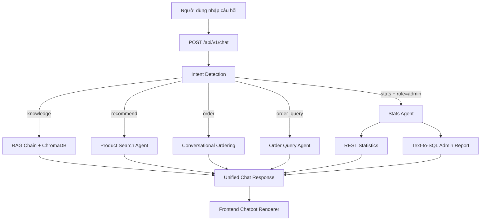
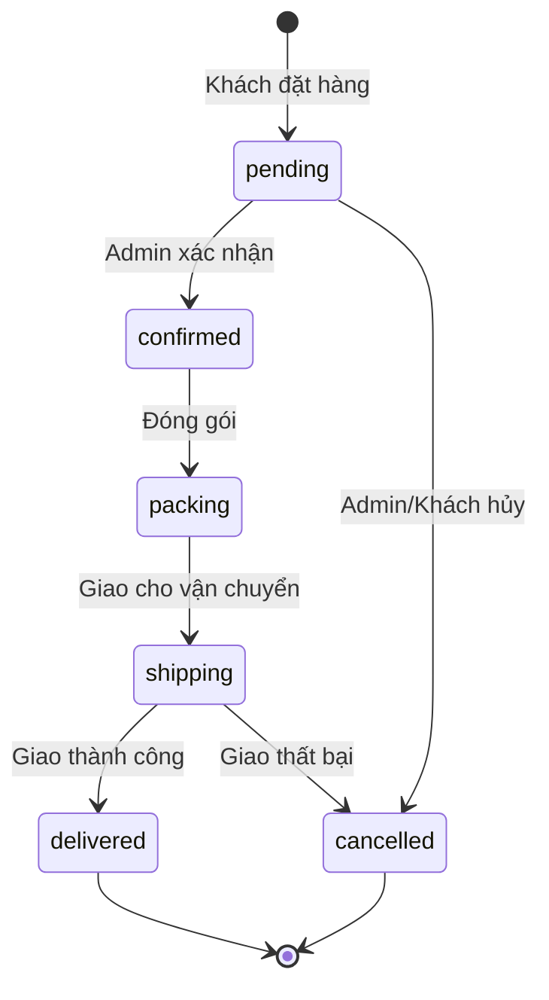

# TÀI LIỆU MÔ TẢ DỰ ÁN

# Website Bán Đèn Đá Muối Himalaya

---

## 1. Tổng Quan Dự Án

### 1.1. Giới thiệu

Dự án **"Website Bán Đèn Đá Muối Himalaya"** là một nền tảng Thương mại điện tử B2C (Business-to-Consumer) hoàn chỉnh, được phát triển nhằm phục vụ việc bán các sản phẩm đèn đá muối Himalaya trực tuyến. Hệ thống cung cấp đầy đủ các nghiệp vụ thương mại điện tử từ duyệt sản phẩm, đặt hàng, quản lý kho cho đến thống kê doanh thu.

### 1.2. Mục tiêu

- Xây dựng website bán hàng trực tuyến chuyên nghiệp cho sản phẩm đèn đá muối Himalaya
- Cung cấp trải nghiệm mua sắm trực quan với khả năng xem sản phẩm 3D
- Tích hợp hệ thống **Chatbot AI** hỗ trợ tư vấn khách hàng tự động
- Cung cấp công cụ quản trị toàn diện cho chủ cửa hàng

### 1.3. Đối tượng người dùng

Hệ thống phục vụ **3 nhóm người dùng chính**:

| Nhóm                             | Vai trò                    | Mô tả                                                                         |
| -------------------------------- | -------------------------- | ----------------------------------------------------------------------------- |
| **Khách vãng lai (Guest)**       | Duyệt web, xem sản phẩm    | Người dùng chưa đăng nhập, có thể xem sản phẩm và đặt hàng                    |
| **Khách hàng thành viên (User)** | Mua sắm, quản lý tài khoản | Người dùng đã đăng ký, có thể theo dõi đơn hàng, đánh giá sản phẩm            |
| **Quản trị viên (Admin)**        | Quản lý toàn bộ hệ thống   | Chủ cửa hàng/nhân viên vận hành, kiểm soát sản phẩm, đơn hàng, kho, doanh thu |

---

## 2. Kiến Trúc Hệ Thống

### 2.1. Mô hình kiến trúc

Dự án áp dụng mô hình **Client-Server** với kiến trúc tách biệt Frontend và Backend:



### 2.2. Luồng hoạt động chính



---

## 3. Công Nghệ Sử Dụng

### 3.1. Frontend

| Công nghệ             | Phiên bản | Mục đích                                           |
| --------------------- | --------- | -------------------------------------------------- |
| **Next.js**           | 16.1.6    | Framework React, Server-Side Rendering, App Router |
| **React**             | 19.2.3    | Thư viện xây dựng giao diện người dùng             |
| **TypeScript**        | 5.x       | Ngôn ngữ lập trình (typed JavaScript)              |
| **TailwindCSS**       | 4.2.1     | CSS framework utility-first                        |
| **Three.js**          | 0.183.2   | Thư viện đồ họa 3D hiển thị sản phẩm               |
| **React Three Fiber** | 9.5.0     | React renderer cho Three.js                        |
| **Zustand**           | 5.0.11    | Quản lý state toàn cục (giỏ hàng, auth)            |
| **Axios**             | 1.13.6    | HTTP client gọi API                                |
| **react-hot-toast**   | 2.6.0     | Thông báo UI (notifications)                       |
| **react-markdown**    | 10.1.0    | Render Markdown (chatbot response)                 |

### 3.2. Backend

| Công nghệ              | Phiên bản | Mục đích                               |
| ---------------------- | --------- | -------------------------------------- |
| **FastAPI**            | ≥ 0.111.0 | Web framework Python, async, auto-docs |
| **Uvicorn**            | ≥ 0.29.0  | ASGI server chạy ứng dụng              |
| **SQLAlchemy**         | ≥ 2.0.0   | ORM tương tác cơ sở dữ liệu            |
| **Alembic**            | ≥ 1.13.0  | Quản lý migration database             |
| **aiomysql / PyMySQL** | ≥ 0.2.0   | Driver kết nối MySQL (async)           |
| **python-jose**        | ≥ 3.3.0   | Xử lý JWT token xác thực               |
| **bcrypt**             | 4.0.1     | Mã hóa mật khẩu                        |
| **Pydantic Settings**  | ≥ 2.2.0   | Quản lý cấu hình ứng dụng              |

### 3.3. AI / Chatbot

| Công nghệ                  | Phiên bản | Mục đích                                    |
| -------------------------- | --------- | ------------------------------------------- |
| **LangChain**              | ≥ 0.2.0   | Framework xây dựng ứng dụng AI / LLM        |
| **LangGraph**              | ≥ 0.1.0   | Orchestration agent dạng graph              |
| **ChromaDB**               | ≥ 0.5.0   | Vector database lưu trữ embeddings          |
| **Sentence-Transformers**  | ≥ 2.7.0   | Embedding models cục bộ (fallback miễn phí) |
| **LangChain-Google-GenAI** | ≥ 1.0.0   | Tích hợp Google Gemini LLM                  |
| **LangChain-OpenAI**       | ≥ 0.1.0   | Tích hợp OpenAI GPT                         |
| **LangChain-HuggingFace**  | ≥ 0.0.3   | Tích hợp HuggingFace models                 |

### 3.4. Cơ sở dữ liệu & Hạ tầng

| Thành phần           | Công nghệ               | Mô tả                         |
| -------------------- | ----------------------- | ----------------------------- |
| **Database**         | MySQL                   | Hệ quản trị CSDL quan hệ      |
| **Containerization** | Docker                  | Đóng gói backend (Dockerfile) |
| **Testing**          | Pytest + pytest-asyncio | Unit test / integration test  |

---

## 4. Thiết Kế Cơ Sở Dữ Liệu

### 4.1. Sơ đồ thực thể quan hệ (ERD)



### 4.2. Mô tả các bảng chính

| Bảng                           | Mô tả                                                                      |
| ------------------------------ | -------------------------------------------------------------------------- |
| `users`                        | Lưu thông tin người dùng (khách hàng + admin), hỗ trợ phân quyền theo role |
| `categories`                   | Danh mục sản phẩm (phân loại đèn đá muối)                                  |
| `products`                     | Thông tin sản phẩm: giá bán, giá gốc, giá vốn, tồn kho, URL ảnh/3D model   |
| `product_images`               | Bảng lưu nhiều ảnh cho mỗi sản phẩm                                        |
| `uses`                         | Công dụng sản phẩm (quan hệ nhiều-nhiều qua `product_uses`)                |
| `orders`                       | Đơn hàng với thông tin người nhận, phương thức thanh toán, trạng thái      |
| `order_items`                  | Chi tiết từng sản phẩm trong đơn hàng                                      |
| `reviews`                      | Đánh giá sản phẩm của khách hàng (có cả phản hồi admin)                    |
| `stock_logs`                   | Lịch sử nhập/xuất/điều chỉnh kho                                           |
| `data_sources` / `data_chunks` | Dữ liệu nguồn cho AI Chatbot (RAG)                                         |

---

## 5. Phân Tích Chức Năng Chi Tiết

### 5.1. Khu Vực Khách Hàng (Front-end Public)

Phần giao diện công khai dành cho mọi người dùng truy cập:

| Module                                   | Chức năng                                                                                     |
| ---------------------------------------- | --------------------------------------------------------------------------------------------- |
| **Trang chủ** (`home`)                   | Hiển thị sản phẩm nổi bật, banner quảng cáo, danh mục sản phẩm, điều hướng chính              |
| **Giới thiệu** (`about`)                 | Thông tin về cửa hàng, lịch sử hình thành, tầm nhìn và sứ mệnh                                |
| **Liên hệ** (`contact`)                  | Form liên hệ, địa chỉ, số điện thoại, bản đồ                                                  |
| **Chi tiết sản phẩm** (`product_detail`) | Xem chi tiết sản phẩm: hình ảnh, **hiển thị 3D**, giá cả, thông số, đánh giá, thêm giỏ hàng   |
| **Giỏ hàng** (`cart`)                    | Quản lý sản phẩm đã chọn: tăng/giảm số lượng, xóa, tính tổng tiền                             |
| **Thanh toán** (`checkout`)              | Điền thông tin giao hàng, chọn phương thức thanh toán (COD / Chuyển khoản), xác nhận đặt hàng |
| **Chatbot AI** (`chatbot`)               | Trợ lý ảo tự động tư vấn sản phẩm, giải đáp thắc mắc bằng công nghệ RAG                       |
| **Đăng nhập / Đăng ký** (`login`)        | Xác thực người dùng qua email + mật khẩu, JWT token                                           |

### 5.2. Khu Vực Quản Lý Tài Khoản (User Dashboard)

Dành cho khách hàng đã đăng nhập:

| Module                                    | Chức năng                                                                                 |
| ----------------------------------------- | ----------------------------------------------------------------------------------------- |
| **Bảng điều khiển** (`account_dashboard`) | Tổng quan tài khoản: thống kê đơn hàng, thông tin nhanh                                   |
| **Hồ sơ cá nhân** (`account_profile`)     | Xem/chỉnh sửa thông tin: họ tên, SĐT, ngày sinh, giới tính, địa chỉ, avatar, đổi mật khẩu |
| **Lịch sử đơn hàng** (`account_orders`)   | Theo dõi trạng thái đơn hàng, xem chi tiết đơn đã đặt                                     |

### 5.3. Khu Vực Quản Trị Hệ Thống (Admin Dashboard)

Dành cho quản trị viên:

| Module                                                | Chức năng                                                                                                 |
| ----------------------------------------------------- | --------------------------------------------------------------------------------------------------------- |
| **Tổng quan** (`admin_general`)                       | Dashboard tóm tắt: doanh thu ngày, đơn hàng pending, số liệu quan trọng                                   |
| **Quản lý sản phẩm** (`admin_products`)               | CRUD sản phẩm: thêm, sửa, xóa, upload ảnh/3D model, quản lý trạng thái                                    |
| **Quản lý danh mục & công dụng** (`admin_categories`) | CRUD danh mục sản phẩm và công dụng sản phẩm                                                              |
| **Quản lý đơn hàng** (`admin_orders`)                 | Xem danh sách đơn, cập nhật trạng thái (pending → confirmed → packing → shipping → delivered / cancelled) |
| **Quản lý khách hàng** (`admin_customers`)            | Xem danh sách tài khoản, thông tin liên hệ, lịch sử mua hàng                                              |
| **Quản lý đánh giá** (`admin_reviews`)                | Kiểm duyệt và phản hồi đánh giá sản phẩm từ khách hàng                                                    |
| **Quản lý kho hàng** (`admin_stock`)                  | Ghi nhận nhập/xuất kho, kiểm soát tồn kho, cảnh báo hết hàng                                              |
| **Thống kê & Báo cáo** (`admin_statistics`)           | Biểu đồ doanh thu, sản phẩm bán chạy, lưu lượng truy cập theo ngày/tuần/tháng                             |
| **Quản lý dữ liệu AI** (`admin_data`)                 | Quản lý nguồn dữ liệu cho chatbot: thêm/xóa data source, tạo index embeddings                             |

---

## 6. Hệ Thống API

### 6.1. Tổng quan API Endpoints

Hệ thống sử dụng kiến trúc **RESTful API** với prefix `/api/v1`. Tài liệu API tự động được tạo tại:

- **Swagger UI**: `http://localhost:8000/docs`
- **ReDoc**: `http://localhost:8000/redoc`

### 6.2. Danh sách nhóm API

| Nhóm                     | Prefix                      | Mô tả                                                            |
| ------------------------ | --------------------------- | ---------------------------------------------------------------- |
| **Auth**                 | `/api/v1/auth`              | Đăng ký, đăng nhập, lấy thông tin user, cập nhật profile         |
| **Products**             | `/api/v1/products`          | Lấy danh sách/chi tiết sản phẩm, categories, uses, reviews       |
| **Orders**               | `/api/v1/orders`            | Tạo đơn hàng, xem lịch sử đơn                                    |
| **Chat (AI)**            | `/api/v1/chat`              | Gửi câu hỏi, nhận phản hồi từ AI chatbot                         |
| **Admin — Catalog**      | `/api/v1/admin/...`         | CRUD danh mục, công dụng                                         |
| **Admin — Products**     | `/api/v1/admin/...`         | CRUD sản phẩm (có upload ảnh)                                    |
| **Admin — Orders**       | `/api/v1/admin/...`         | Quản lý, cập nhật trạng thái đơn hàng                            |
| **Admin — Users**        | `/api/v1/admin/...`         | Quản lý tài khoản người dùng                                     |
| **Admin — Reviews**      | `/api/v1/admin/...`         | Kiểm duyệt, phản hồi đánh giá                                    |
| **Admin — Stock**        | `/api/v1/admin/...`         | Quản lý kho, ghi nhận nhập/xuất                                  |
| **Admin — Statistics**   | `/api/v1/admin/...`         | Lấy dữ liệu thống kê, biểu đồ                                    |
| **Admin — Data Sources** | `/api/v1/admin/...`         | Quản lý dữ liệu nguồn cho AI                                     |
| **Admin — AI Chat**      | `/api/v1/admin/chat/report` | Truy vấn báo cáo kinh doanh bằng ngôn ngữ tự nhiên (Text-to-SQL) |

---

## 7. Hệ Thống Chatbot AI (RAG)

### 7.1. Tổng quan kiến trúc chatbot

Chatbot hiện tại là một hệ thống **hybrid** gồm 3 lớp:

1. **Unified Chat Router** (backend): Nhận mọi câu hỏi tại `POST /api/v1/chat`, tự phát hiện intent và route sang luồng xử lý phù hợp.
2. **Knowledge RAG + Business Agent**: Kết hợp RAG kiến thức sản phẩm, gợi ý sản phẩm, đặt hàng qua chat, tra cứu đơn hàng, và thống kê cho admin.
3. **Rich Chat UI** (frontend): Render đa dạng kiểu phản hồi (`text`, `product_cards`, `checkout_form`, `order_list`, `order_detail`, `stats`) thay vì chỉ văn bản thuần.



### 7.2. Thành phần backend chính

| Thành phần                 | File/Module                                         | Vai trò                                                                                                             |
| -------------------------- | --------------------------------------------------- | ------------------------------------------------------------------------------------------------------------------- |
| **Chat Router**            | `backend/app/routers/chat.py`                       | Cung cấp endpoint unified `/chat` và các endpoint chuyên biệt (`/chat/knowledge`, `/chat/recommend`, `/chat/order`) |
| **Admin Chat Router**      | `backend/app/routers/admin_chat.py`                 | Endpoint admin `/api/v1/admin/chat/report` cho Text-to-SQL báo cáo                                                  |
| **Intent + Orchestration** | `backend/app/services/ai_agent/agent.py`            | Detect intent, route theo ngữ cảnh/role, chuẩn hóa payload response cho frontend                                    |
| **RAG Chain**              | `backend/app/services/ai_agent/chains/rag_chain.py` | Truy xuất context từ ChromaDB, sinh answer + sources                                                                |
| **LLM Provider**           | `backend/app/services/ai_agent/llm.py`              | Factory singleton LLM theo `LLM_PROVIDER`                                                                           |
| **Vector Store**           | `backend/app/services/ai_agent/vector_store.py`     | Kết nối ChromaDB persistent, tách collection theo embedding provider                                                |
| **Ingestion Pipeline**     | `backend/app/services/ai_agent/ingestion.py`        | Chunking, indexing, reindex, đồng bộ dữ liệu nguồn -> vector store                                                  |
| **Admin Data CRUD**        | `backend/app/services/crud/admin_data.py`           | Upload/list/reindex/delete data source, theo dõi index job                                                          |
| **Agent Tools**            | `backend/app/services/ai_agent/tools/`              | Tool tìm sản phẩm, thêm giỏ hàng, text-to-sql                                                                       |

### 7.3. Luồng intent và response type

`run_chat()` trong `agent.py` đang hỗ trợ các intent:

- `knowledge`: Hỏi kiến thức đèn đá muối -> trả lời RAG + `sources`
- `recommend`: Gợi ý sản phẩm -> `response_type=product_cards`
- `order`: Đặt hàng/thêm giỏ qua chat (yêu cầu đăng nhập)
- `order_query`: Tra cứu danh sách đơn hoặc chi tiết đơn (yêu cầu đăng nhập)
- `stats`: Thống kê kinh doanh (chỉ admin)

Các `response_type` hiện tại backend/frontend cùng thống nhất:

- `text`
- `product_cards`
- `checkout_form`
- `order_list`
- `order_detail`
- `stats`

### 7.4. Session memory và hội thoại đa lượt

Chatbot dùng `session_id` để lưu memory nhẹ theo phiên chat:

- Lưu các câu hỏi gần nhất của người dùng
- Lưu danh sách sản phẩm vừa gợi ý
- Với các câu follow-up mơ hồ (ví dụ: "cái đó", "mẫu đó"), agent sẽ tự bổ sung ngữ cảnh từ lượt trước trước khi detect intent

Giúp chatbot bám mạch hội thoại tốt hơn trong các luồng tư vấn/mua hàng nhiều bước.

### 7.5. Chatbot mua hàng và đồng bộ giỏ

Luồng mua hàng qua chat gồm các bước:

1. Detect intent `order`
2. Tìm sản phẩm từ câu người dùng + trích số lượng
3. Gọi tool thêm giỏ hàng backend
4. Nếu thành công, backend trả `cart_updated=true` và dữ liệu cart item
5. Frontend đồng bộ dữ liệu này vào Zustand cart store và render `checkout_form` ngay trong chat

Ngoài ra, chatbot frontend cũng hỗ trợ mở giỏ/thanh toán trực tiếp từ cart store khi người dùng nhập các câu như "xem giỏ hàng" hoặc "checkout".

### 7.6. Tra cứu đơn hàng trong chatbot

- Người dùng đăng nhập có thể hỏi "đơn hàng của tôi", "đơn #123"...
- Bot trả `order_list` (danh sách đơn gần đây) hoặc `order_detail` (chi tiết một đơn)
- UI chat có panel riêng để filter/phân trang đơn hàng, xem chi tiết, mua lại

### 7.7. Thống kê admin trong chatbot

Khi user role là admin và intent là `stats`, chatbot chọn một trong 2 nguồn:

- **REST mode**: Dùng API thống kê chuẩn (KPI, top sản phẩm, trạng thái đơn, biểu đồ doanh thu)
- **Text-to-SQL mode**: Sinh SQL SELECT an toàn từ câu hỏi tự nhiên, thực thi, rồi tóm tắt kết quả

Frontend render `stats` dưới dạng widget tương ứng (`kpi`, `revenue_chart`, `top_products`, `order_status`, `table`) và hiển thị metadata nguồn (`rest` hoặc `text_to_sql`).

### 7.8. RAG Knowledge Base và Data Ingestion

Quản trị viên quản lý dữ liệu RAG qua nhóm API admin data source:

- `POST /api/v1/admin/data-sources/upload`
- `GET /api/v1/admin/data-sources`
- `POST /api/v1/admin/data-sources/{source_id}/reindex`
- `DELETE /api/v1/admin/data-sources/{source_id}`
- `GET /api/v1/admin/data-sources/jobs/{job_id}`

Khi upload/reindex, hệ thống tạo background index job, chia chunk, tạo embedding theo provider cấu hình, sau đó upsert vào ChromaDB.

### 7.9. LLM và Embedding providers đang hỗ trợ

**LLM providers** (cấu hình qua `LLM_PROVIDER`):

| Provider           | Model mặc định             | Ghi chú              |
| ------------------ | -------------------------- | -------------------- |
| OpenAI             | `gpt-4o-mini`              | Cần `OPENAI_API_KEY` |
| Google Gemini      | `gemini-1.5-flash`         | Cần `GOOGLE_API_KEY` |
| Ollama             | `llama3.2`                 | Chạy local           |
| HuggingFace Router | `openai/gpt-oss-120b:groq` | Cần `HF_TOKEN`       |

**Embedding providers** (cấu hình qua `EMBEDDING_PROVIDER`):

| Provider   | Mô tả                                                                           |
| ---------- | ------------------------------------------------------------------------------- |
| `baseline` | OpenAI Embeddings (nếu có key), fallback sang HuggingFace sentence-transformers |
| `gemini`   | Google Generative AI Embeddings, có fallback model nếu model chính lỗi          |

Hệ thống dùng collection name theo provider để tránh xung đột chiều vector giữa các embedding model khác nhau.

---

## 8. Cấu Trúc Thư Mục Dự Án

```
web_ban_da_muoi/
├── frontend/                     # Next.js Frontend
│   ├── src/
│   │   ├── app/                  # App Router (pages)
│   │   │   ├── (auth)/           # Route group: đăng nhập/đăng ký
│   │   │   ├── (shop)/           # Route group: trang public
│   │   │   │   ├── about/        #   Giới thiệu
│   │   │   │   ├── account/      #   Quản lý tài khoản
│   │   │   │   ├── cart/         #   Giỏ hàng
│   │   │   │   ├── checkout/     #   Thanh toán
│   │   │   │   ├── contact/      #   Liên hệ
│   │   │   │   ├── product/      #   Chi tiết sản phẩm
│   │   │   │   └── page.tsx      #   Trang chủ
│   │   │   └── admin/            # Route group: admin dashboard
│   │   │       ├── categories/   #   Quản lý danh mục
│   │   │       ├── customers/    #   Quản lý khách hàng
│   │   │       ├── dashboard/    #   Tổng quan
│   │   │       ├── data/         #   Quản lý data AI
│   │   │       ├── orders/       #   Quản lý đơn hàng
│   │   │       ├── products/     #   Quản lý sản phẩm
│   │   │       ├── reviews/      #   Quản lý đánh giá
│   │   │       ├── statistics/   #   Thống kê
│   │   │       └── stock/        #   Quản lý kho
│   │   ├── components/           # React components tái sử dụng
│   │   │   ├── admin/            #   Components cho admin
│   │   │   ├── layout/           #   Header, Footer, Sidebar
│   │   │   ├── shop/             #   Components cho shop
│   │   │   └── ui/               #   Components UI chung
│   │   ├── lib/                  # Utilities, helpers
│   │   ├── services/             # API service layer (Axios)
│   │   ├── store/                # Zustand stores (auth, cart)
│   │   └── types/                # TypeScript type definitions
│   ├── public/                   # Static assets
│   ├── package.json
│   └── tsconfig.json
│
├── backend/                      # FastAPI Backend
│   ├── app/
│   │   ├── core/                 # Config, Security, Dependencies
│   │   │   ├── config.py         #   Cấu hình ứng dụng (Pydantic Settings)
│   │   │   ├── security.py       #   JWT token, hash password
│   │   │   └── dependencies.py   #   Dependency injection
│   │   ├── db/                   # Database setup
│   │   ├── models/               # SQLAlchemy ORM Models
│   │   │   ├── user.py           #   User, UserRole
│   │   │   ├── product.py        #   Product
│   │   │   ├── category.py       #   Category
│   │   │   ├── order.py          #   Order, OrderItem
│   │   │   ├── review.py         #   Review
│   │   │   ├── stock_log.py      #   StockLog
│   │   │   └── data_source.py    #   DataSource, DataChunk (AI)
│   │   ├── schemas/              # Pydantic Request/Response schemas
│   │   ├── routers/              # API route handlers
│   │   │   ├── auth.py           #   Authentication endpoints
│   │   │   ├── products.py       #   Product public endpoints
│   │   │   ├── orders.py         #   Order endpoints
│   │   │   ├── chat.py           #   AI Chat endpoints
│   │   │   ├── admin_*.py        #   Admin endpoints (7 modules)
│   │   │   └── admin_chat.py     #   Admin AI management
│   │   ├── services/
│   │   │   ├── crud/             #   CRUD operations cho từng entity
│   │   │   └── ai_agent/         #   AI Chatbot engine
│   │   │       ├── agent.py      #     Main agent logic
│   │   │       ├── llm.py        #     LLM provider abstraction
│   │   │       ├── vector_store.py #   ChromaDB management
│   │   │       ├── ingestion.py  #     Data ingestion pipeline
│   │   │       ├── embeddings/   #     Embedding providers
│   │   │       ├── chains/       #     LangChain chains
│   │   │       └── tools/        #     Agent tools
│   │   └── main.py               # FastAPI entrypoint
│   ├── alembic/                  # Database migrations
│   ├── static/uploads/           # Uploaded product images
│   ├── chroma_db/                # ChromaDB vector store data
│   ├── tests/                    # Test suite
│   ├── scripts/                  # Benchmark & utility scripts
│   ├── requirements.txt
│   └── Dockerfile
│
├── UI/                           # UI Mockup/Design (20 modules)
├── AGENTS.md                     # Agent guidelines
└── how_to_run.md                 # Hướng dẫn chạy dự án
```

---

## 9. Tính Năng Nổi Bật

### 9.1. Xem sản phẩm 3D

Sử dụng **Three.js** và **React Three Fiber** để hiển thị mô hình 3D sản phẩm đèn đá muối trực tiếp trên trình duyệt, cho phép người dùng xoay, zoom để xem chi tiết sản phẩm từ mọi góc độ.

### 9.2. Chatbot AI tư vấn (RAG)

Hệ thống chatbot thông minh sử dụng kỹ thuật **Retrieval-Augmented Generation**:

- Tự động tìm kiếm thông tin phù hợp từ vector database (ChromaDB) và trả về kèm nguồn tham chiếu
- Hỗ trợ đa luồng hội thoại: tư vấn kiến thức, gợi ý sản phẩm, đặt hàng qua chat, tra cứu đơn hàng
- Hỗ trợ thống kê admin ngay trong chatbot (REST KPI và Text-to-SQL)
- Hỗ trợ quản trị viên thêm/cập nhật/reindex nguồn dữ liệu kiến thức

### 9.3. Quản lý kho hàng thông minh

- Ghi nhận lịch sử nhập/xuất kho chi tiết
- Cảnh báo khi tồn kho dưới mức tối thiểu (`min_stock`)
- Tự động trừ kho khi có đơn hàng mới

### 9.4. Hệ thống phân quyền

- **JWT-based authentication** với token có thời hạn
- Phân quyền rõ ràng: `customer` / `admin`
- Middleware bảo vệ toàn bộ API admin

### 9.5. Thống kê & Báo cáo

- Biểu đồ doanh thu theo thời gian
- Sản phẩm bán chạy nhất
- Tổng hợp số liệu đơn hàng theo trạng thái

---

## 10. Hướng Dẫn Cài Đặt & Chạy Dự Án

### 10.1. Yêu cầu hệ thống

- **Python** ≥ 3.10
- **Node.js** ≥ 18
- **MySQL** ≥ 8.0
- **Git**

### 10.2. Cài đặt Backend

```bash
# Tạo virtual environment
python -m venv .venv

# Kích hoạt môi trường ảo
.venv/Scripts/activate          # Windows
# source .venv/bin/activate     # Linux/macOS

# Cài đặt dependencies
pip install -r backend/requirements.txt

# Cấu hình biến môi trường
cp backend/.env.example backend/.env
# Chỉnh sửa file .env với thông tin database, API keys...

# Chạy migration database
cd backend
alembic upgrade head

# Khởi động server
uvicorn app.main:app --reload --port 8000
```

### 10.3. Cài đặt Frontend

```bash
cd frontend

# Cài đặt dependencies
npm install

# Cấu hình biến môi trường
cp .env.production.example .env.local
# Chỉnh sửa NEXT_PUBLIC_API_URL nếu cần

# Khởi động dev server
npm run dev
```

### 10.4. Truy cập ứng dụng

| Thành phần                      | URL                          |
| ------------------------------- | ---------------------------- |
| **Frontend**                    | http://localhost:3000        |
| **Backend API**                 | http://localhost:8000        |
| **API Documentation (Swagger)** | http://localhost:8000/docs   |
| **API Documentation (ReDoc)**   | http://localhost:8000/redoc  |
| **Health Check**                | http://localhost:8000/health |

---

## 11. Quy Trình Thanh Toán



**Phương thức thanh toán hỗ trợ:**

- **COD** (Cash on Delivery): Thanh toán khi nhận hàng
- **Chuyển khoản ngân hàng** (Bank Transfer)

---

## 12. Bảo Mật

| Khía cạnh           | Giải pháp                                                    |
| ------------------- | ------------------------------------------------------------ |
| **Xác thực**        | JWT Token (HS256), hết hạn sau 24 giờ                        |
| **Mã hóa mật khẩu** | bcrypt hashing                                               |
| **CORS**            | Chỉ cho phép origins được cấu hình                           |
| **Phân quyền**      | Role-based (customer / admin) trên mọi API endpoint          |
| **Validation**      | Pydantic schema validation trên tất cả request               |
| **Error Handling**  | Global exception handlers trả về format chuẩn `BaseResponse` |

---

## 13. Kết Luận

Dự án **Website Bán Đèn Đá Muối Himalaya** là một hệ thống thương mại điện tử B2C hoàn chỉnh, được xây dựng trên nền tảng công nghệ hiện đại (Next.js 16 + FastAPI). Đặc biệt, dự án tích hợp nhiều tính năng tiên tiến:

- **Hiển thị sản phẩm 3D** trên trình duyệt bằng Three.js
- **Chatbot AI thông minh** sử dụng kỹ thuật RAG với LangChain/LangGraph
- **Hỗ trợ đa nhà cung cấp LLM** (OpenAI, Gemini, HuggingFace, Ollama)
- **Hệ thống quản trị toàn diện** với 9 module quản lý

Dự án được tổ chức bài bản, áp dụng các nguyên tắc phát triển phần mềm tốt như: tách biệt Frontend/Backend, sử dụng ORM cho database, migration quản lý schema, testing tự động, containerization với Docker, và tài liệu API tự động.
